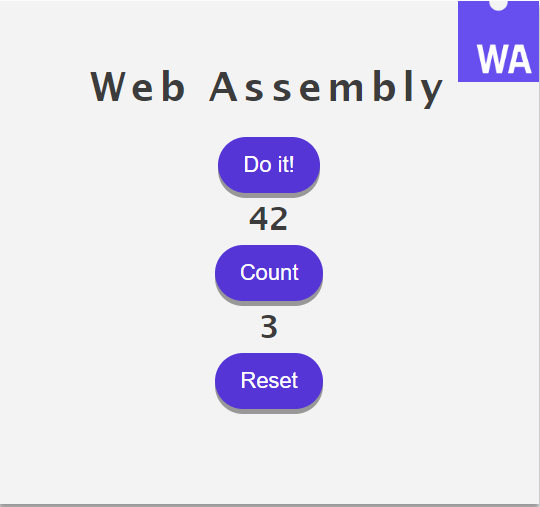

# WebAssemblyBasicSample
This repository aims to serve as an introductory sample for developers getting started on Web Assembly. It contains a basic website which can load wasm files. The wasm is derived from C code and contains 2 functions: one for updating a counter variable, and another which returns the number 42. These 2 functions are called from JavaScript in order to update the DOM.

## Getting Started

1. In the Workspace directory run the command npm install
2. In the Workspace directory run the command npm start

## Authors
Francisco Vilches - https://github.com/fvilches17
Prabakaran Veer - https://github.com/veerprabakar

## Notes
This solution contains C code. The C code was compiled into .wasm and downloaded by using https://wasdk.github.io/WasmFiddle/

You can always get a Web Assembly-Supported compiler up and running on your local machine. But in order to keep this demo simple we are relying on Wasm Fiddle in order to add/modify .wasm files.
